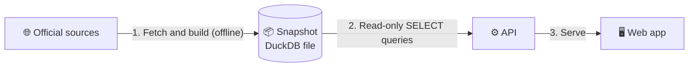

# 🧱 BundesPulse: Data, Structure & Technology

**What the platform covers, where the numbers come from, how they're organised, and how the app is built.**

[← Back to the main README](README.md)

> [!NOTE]
> This document is more technical than the main README, but stays high level on purpose. The product matters more than the stack.

 

## 📑 Contents

- [🎯 Purpose](#-purpose)
- [📐 Coverage](#-coverage)
- [🗂️ Where the data comes from](#️-where-the-data-comes-from)
- [🏗️ How the data is organised](#️-how-the-data-is-organised)
- [🧰 Technology](#-technology)
- [📌 Important notes](#-important-notes)
- [⚠️ Known limitations](#️-known-limitations)
- [©️ Attribution](#️-attribution)

---

## 🎯 Purpose

**BundesPulse (Deutschland Digital Monitor)** is a **read-only** platform for German regional statistics. You can explore, compare, rank and interpret official public data for:

| 🇩🇪 Federation | 🏛️ Bundesländer | 🏘️ Kreise & cities |
|:-:|:-:|:-:|
| 1 | 16 | ~400 |

The goal is simple: make official regional data **easy to look at**, and make the numbers **understandable without a statistics background**.

---

## 📐 Coverage

| Dimension | Value |
|---|---|
| 📊 **Indicators** | **111** |
| 🏷️ **Topics** | **15** |
| 📍 **Regions** | **~417** (1 Bund + 16 Bundesländer + ~400 Kreise) |
| 📅 **Time span** | roughly **1990–2025**, depending on the indicator |
| 🪜 **Levels** | Bund · Bundesland · Kreis |

<b>See all 15 topics</b>

 

`Demography` · `Labour` · `Employment` · `Economy` · `Income` · `Housing` · `Education` · `Environment` · `Agriculture` · `Industry` · `Mobility` · `Infrastructure` · `Tourism` · `Health` · `Public finance`

---

## 🗂️ Where the data comes from

All values come from **free, official German sources**. Data is fetched and cached ahead of time, and **the app never contacts these sources at runtime.**

| Source | Contributes |
|---|---|
| 🗺️ **Regionalatlas / Regionaldatenbank Deutschland** | 80 indicators for Länder and Kreise (~2000–2024), via the official ArcGIS REST service |
| 🏛️ **Statistisches Bundesamt (Destatis)** | Population and age structure, foreign share, dependency ratios, housing construction, road accidents and fatalities |
| 💶 **Arbeitskreis VGR der Länder** | GDP, GDP per capita and GDP growth |
| 👷 **Bundesagentur für Arbeit** | Unemployment, quota and demographic breakdowns |
| ⚡ **Bundesnetzagentur** | Public charging points, including fast charging |
| 🌫️ **Umweltbundesamt** | Air-quality stations mapped to regions |
| 🧭 **BKG (VG250)** | Official region boundaries for the maps |

> [!TIP]
> Every indicator is linked to its source, including the retrieval date, inside the app.

---

## 🏗️ How the data is organised

The platform uses a **read-only snapshot** model.

| Step | What happens |
|:-:|---|
| **1. Fetch and build** *(offline)* | A Python pipeline downloads the official sources and merges them into one database file (DuckDB). **This is the only step that touches the internet.** |
| **2. Snapshot** | The build produces an **immutable** snapshot with the base tables and a few precomputed tables (`rankings`, `trends`, `insights`) so the app stays fast. |
| **3. Serve** | The API opens the snapshot in **read-only** mode and only runs `SELECT` queries. Nothing is written at runtime. |

### 🧩 The core data model

The data comes down to three simple ideas:

| Concept | Meaning |
|---|---|
| 📍 **Regions** | Bund, Bundesländer and Kreise, each with a stable code (**AGS**) |
| 📏 **Indicators** | The measures (e.g. GDP per capita, unemployment rate), each with a unit, a topic and a source |
| 🔢 **Observations** | One value for **one region**, **one indicator** and **one year** |

Rankings, trends and insights are computed during the build and stored, so listings and comparisons are quick and reproducible.

### 🪜 Levels

| Level | Description |
|---|---|
| **Bund** | The national reference point, used for "vs. Germany" comparisons |
| **Bundesländer** | The 16 federal states |
| **Kreise** | Districts and independent cities |

> [!NOTE]
> Not every indicator exists at every level or for every year. Where a value is missing, the app shows **"keine Daten"**.

---

## 🧰 Technology

| Layer | What it uses |
|---|---|
| 🖥️ **Web app** | React with TypeScript, built with Vite. Charts use Apache ECharts; the map uses MapLibre with the official BKG boundaries. |
| ⚙️ **API** | Python with FastAPI. Reads a DuckDB file in read-only mode. |
| 🔧 **Pipeline** | A Python data-build step that fetches, cleans and merges the sources into the snapshot. |
| 🚀 **Deployment** | The web app is static (any static host). The API runs in a container that already contains the snapshot. |

**By design, there are:**

- ❌ no user accounts
- ❌ no uploads
- ❌ no editing
- ❌ no runtime calls to external data services

---

## 📌 Important notes

| | Note |
|:-:|---|
| 🔢 | **Numbers are shown as published.** Different sources can report similar measures slightly differently. Where that happens, both are kept and labelled by source. |
| ⚖️ | **Comparisons are neutral.** The app shows differences and ranks, but never declares one region globally "better". |
| 🔗 | **Correlation is not causation.** The Relationships page shows associations only. |
| 🧊 | **Reproducible by design.** Everything is prepared in a single snapshot, so what you see does not change between sessions. |

---

## ⚠️ Known limitations

> [!WARNING]
> Some data gaps exist today.

- 🌫️ **Air quality:** NO₂ and PM10 values are currently not available.
- 📅 **Employment, housing and charging:** each covers a **single year**.
- 👷 **Unemployment:** available at **Kreis level only**.
- 👥 **Regional population:** covers **2023 to 2024**.

---

## ©️ Attribution

Data belongs to its respective official publishers. **BundesPulse only presents it.**

 

[⬆ Back to top](#-bundespulse-data-structure--technology)

